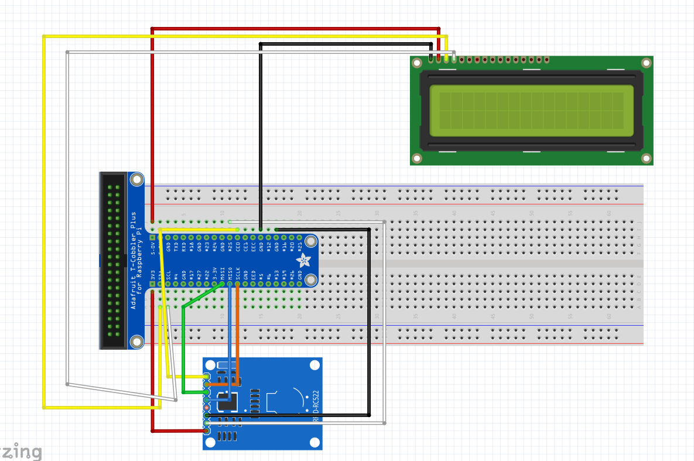
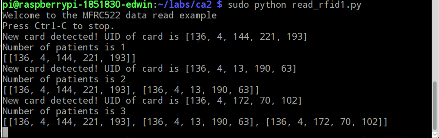
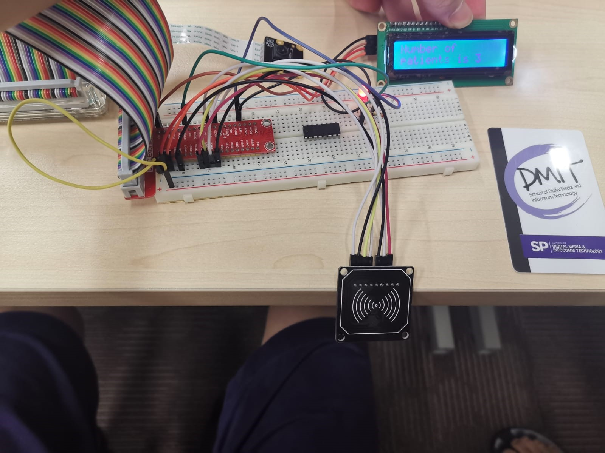
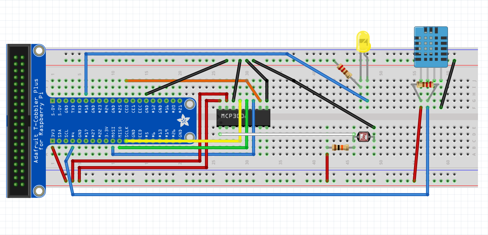
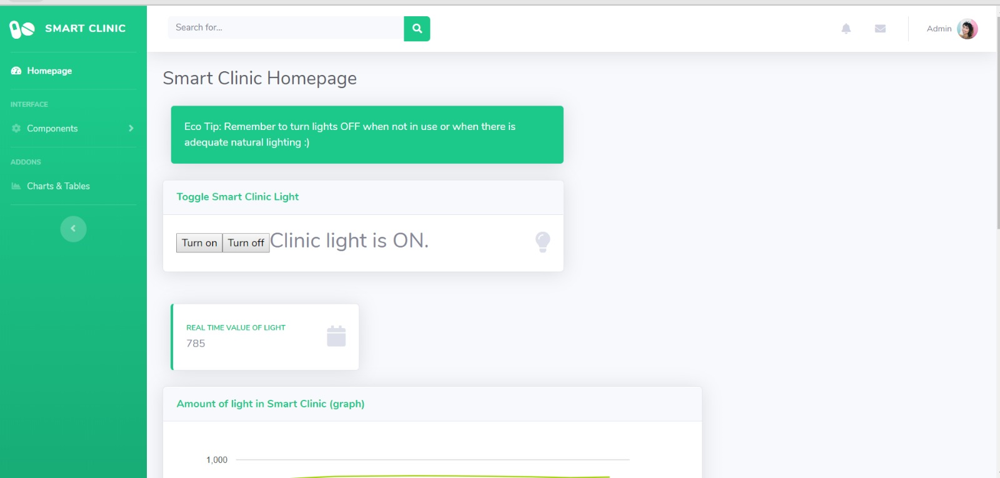

# How to make a Smart Clinic using IoT devices

## 1. Overview
Clinics are usually crowded and can have long waiting times. Sometimes, it would be helpful if the clinic could display the number of people in the queue so we can estimate our waiting time. This tutorial will show you how to read the RFID cards of patients going into a clinic and display the number of people who have already entered the clinic on an LCD display. This tutorial will also teach you how to remotely control the light source inside the clinic waiting room and get readings of light intensity, temperature and humidity of the waiting room.

## 2. Setting up your RFID card reader & LCD display

### Hardware needed:
* MFRC522 card reader module x1
* 16x2 LCD display x1
* Red LED x1

### Setup the hardware
Setup the hardware as shown in the Fritzing diagram below


### Install the necessary libraries
In your raspberry pi, install the rpi-lcd library to manipulate LCD display
`sudo pip install rpi-lcd`

Follow the following steps to prepare the libraries for the MFRC522 card reader
1. Go to your raspberrypi and run raspi-config
`sudo rasp-config`
2. Select "Interfacing Options" and enable SPI
3. Modify the /boot/config.txt to enable SPI
`sudo nano /boot/config.txt`
4. Ensure these lines are included in config.txt
```
device_tree_param=spi=on
dtoverlay=spi-bcm2835
```
5. Install the Python development libraries
`sudo apt-get install python-dev`
6. Set up the SPI Python libraries since the card reader uses the SPI interface
```
cd ~
git clone https://github.com/lthiery/SPI-Py.git
cd ~/SPI-Py
sudo python setup.py install
```
7. Clone the MFRC522-python library to your home folder as follows:
```
cd ~
git clone https://github.com/pimylifeup/MFRC522-python.git
cd ~/MFRC522-python
sudo python setup.py install
```

### Run the `aws_pubsub_edited1.py` and `read_rfid1.py` files
**NOTE:** Ensure that in `aws_pubsub_edited1.py`, you have changed the host name, rootCA path, certificate path, private key path, AWSIoTMQTTClient and deviceid accordingly to match your own AWS credentials.

The code in `read_rfid1.py` reads the NFC card values, counts the number of people entering and leaving, and displays the total number of people queueing inside the clinic waiting room on an LCD display.
The code in `aws_pubsub_edited1.py` publishes the NFC card ID to the database in AWS DynamoDB and sends an email alert to the clinic administrator when customers enter the clinic.

On your raspberrypi, run `sudo python aws_pubsub_edited1.py` in one terminal window, and `sudo python read_rfid.py` in a 2nd terminal window.


### Expected Outcome
On your raspberrypi terminal window, you should see the following results as you tap different RFID cards against the MFRC522 card reader.


This is what your setup should look like. The LCD should display 'Number of patients is' and the number of cards that have been scanned with the MFRC522 card reader.


## 2. Setting up light, temperature and humidity sensors

### Hardware needed
* LDR x1
* DHT11 x1
* Yellow LED x1

### Setup the hardware
Setup the hardware as shown in the Fritzing diagram below


### Run the `aws_pubsub_edited.py` and `server.py` files
**NOTE:** Ensure that in `aws_pubsub_edited.py`, you have changed the host name, rootCA path, certificate path, private key path, AWSIoTMQTTClient and deviceid accordingly to match your own AWS credentials.

The code in `aws_pubsub_edited.py` publishes the light intensity, temperature and humidity values to the database in AWS DynamoDB.
The code in `server.py` starts the webserver on Flask. 

On your raspberrypi, run `sudo python aws_pubsub_edited.py` in one terminal window, and `python server.py` in a 2nd terminal window.

Open your preferred internet browser and type `<your ip address>:5000` into the address bar.

### Expected Outcome
You should see the following web application interface displaying the real-time, graphical and tabular values of light intensity, temperature and humidity. It also allows you to remotely toggle the room light (yellow LED) on and off.



